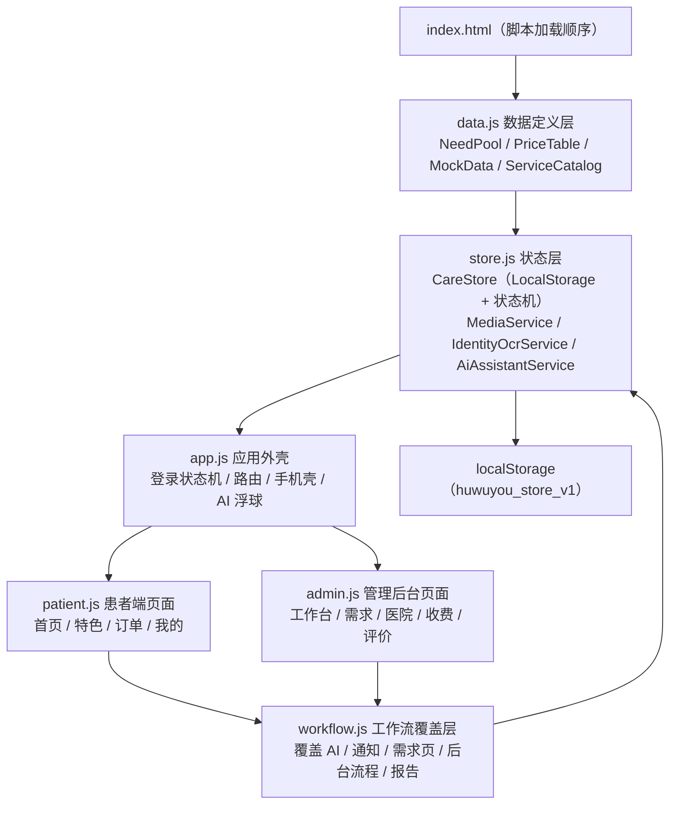

# 项目完整分析报告

> 分析对象：`D:\智能陪护-开发交接包-20260720`（护无忧 · 智陪诊全链路平台）
> 分析时间：2026-08-08
> 分析原则：**代码实现是唯一事实来源**；文档仅作辅助参考，凡与代码冲突之处均以代码为准并在本报告中标注。

## 0. 执行摘要

这是一个**零构建、无依赖、纯前端的演示型单页应用**（原生 HTML/CSS/JavaScript + 浏览器 LocalStorage），没有后端、数据库、真实认证、短信、支付、地图或推送能力。项目包含患者端（手机壳形态）、管理后台（SaaS 布局）和一套跨端状态机工作流，演示了"患者提交陪诊需求 → 后台派单/推进状态 → 发布陪诊报告 → 患者查看"的完整闭环。

三个最重要的结论：

1. **当前工作区处于一次未提交的患者端改版中途**：`patient.js`/`data.js`/`style.css`/`app.js` 自 2026-08-08 起有大量未提交修改（患者端从"陪诊师 Tab"改为"特色医院 Tab"，新增首页 2×2 服务入口、统一预约表单等），而 `workflow.js`（已提交）中为旧版患者端设计的"我的需求 / 陪诊进度 / 医院介绍"页面**仍然存在但没有任何入口可达**，属于失效代码。
2. **存在三套相互冲突的需求状态流**：`data.js` 注释与旧管理端用"待处理→已分配→已对接→服务中→已完成"，`CareStore.transitionNeed` 与 07-17 设计规格用"待处理→已分配→服务中→已完成（待处理/已分配→已取消）"，而新患者端预约流程还会直接创建 `已对接` 订单，导致这类订单在管理端**永远无法推进**。
3. **文档总体诚实但明显滞后**：README 与 07-17 设计规格最接近代码现状，但仍夸大或错报了若干功能（演示 OCR、陪诊进度页、新增医院申请、患者评价、紧急联系在现行 UI 中不可达或未实现）；技术汇报 PPT（`ppt.html`）整体描述的是旧版实现（DeepSeek 集成、财务数据、`已对接` 流程），与当前代码不符；演讲稿声称 Store 版本号为 1，实际为 2。

---

## 1. 项目概览

| 项目 | 内容 |
| --- | --- |
| 项目名称 | 护无忧 · 智陪诊全链路平台 |
| 项目类型 | 纯前端交互演示原型（非生产系统） |
| 开发语言 | 原生 HTML5 / CSS3 / JavaScript（ES2020 语法，无模块化） |
| 框架/依赖 | 无框架、无 npm 依赖、无第三方库（图标为内联 SVG，图片为外链演示图） |
| 构建工具 | 无（无需编译，静态服务器直接托管） |
| 运行环境 | 任意现代浏览器（Chrome 为验收基准）+ 任意静态 Web 服务器；Nginx 参考配置见 `deploy/nginx-huwuyou-demo.conf` |
| 持久化 | 浏览器 LocalStorage（`huwuyou_store_v1` + `huwuyou_patients`） |
| 版本信息 | 页面自称 v2.0；需求文档称 V2.0.0；Git 共 2 个提交（2026-08-06），工作区另有未提交修改（截至 2026-08-08） |
| Git 状态 | 分支 `main`；`index.html`、`app.js`、`data.js`、`patient.js`、`style.css` 有未提交修改；`.vs/` 未跟踪 |
| 代码规模 | JS 约 5,100 行（data 828 / store 362 / app 625 / patient 1941 / admin 1147 / workflow 193），CSS 约 1,532 行，另有 patient.js 运行时注入样式 |

---

## 2. 技术栈分析

### 2.1 技术底座

- **原生 DOM 字符串渲染**：所有页面通过模板字符串 + `innerHTML` 渲染，交互依赖内联 `onclick`/`onchange` 属性与少量 `addEventListener`。
- **全局对象协作**：`NeedPool`、`PriceTable`、`HospitalApplyPool`、`NotifyPool`、`MockData`、`CareStore`、`App`、`Patient`、`Admin`、`WUtil` 全部挂载在全局作用域；`index.html` 中 6 个 `<script>` 的加载顺序即依赖顺序，不可调整。
- **单例状态层**：`CareStore` 统一管理需求、草稿、价格、医院、医院申请、通知、陪诊报告，序列化到 LocalStorage；加载时合并默认字段并做版本校验。
- **媒体处理**：`FileReader` 读图、`Canvas` 压缩为 JPEG Data URL（最长边 1600px、目标 ≤800KB），写入 LocalStorage。
- **"AI/OCR"均为本地演示**：`AiAssistantService` 是关键词/正则解析，`IdentityOcrService` 是固定返回演示数据的假 OCR。
- **部署**：Nginx `location ^~ /huwuyou-demo/` 静态托管 `index.html`，`no-store` 缓存策略。

### 2.2 明确缺失的技术能力（README 亦承认）

后端服务、数据库、对象存储、真实短信验证码、支付、地图/定位、消息推送、真实身份认证、权限与数据隔离、自动化测试、类型检查、工程化构建链全部不存在。图片以 Data URL 存 LocalStorage，容量受限。

---

## 3. 项目结构分析

### 3.1 目录树

```text
智能陪护-开发交接包-20260720/
├── index.html                        # 应用唯一入口：样式/脚本加载顺序 + 根节点
├── README.md                         # 运行说明、架构说明、已知限制、交接清单
├── .gitignore                        # 忽略规则（工作区已移除 .vs/ 条目，见 10.3）
├── .vs/                              # 本机 Visual Studio 用户目录（未跟踪，不应入库）
├── src/
│   ├── scripts/
│   │   ├── data.js                   # 模拟数据与早期数据池（828 行）
│   │   ├── store.js                  # CareStore 状态层 + 媒体/OCR/AI 适配器（362 行）
│   │   ├── app.js                    # 登录状态机、路由、患者端外框、旧版 DeepSeek AI（625 行）
│   │   ├── patient.js                # 患者端新改版页面（首页/特色/订单/我的，1941 行）
│   │   ├── admin.js                  # 管理后台旧版页面（1147 行，部分被 workflow.js 覆盖）
│   │   └── workflow.js               # 方案A工作流覆盖层：状态机、报告、通知、新后台页（193 行）
│   └── styles/
│       ├── style.css                 # 全局变量、登录页、手机壳、后台 SaaS 布局（697 行）
│       └── workflow.css              # 工作流增强、服务中心、医院介绍等样式（835 行）
├── deploy/
│   └── nginx-huwuyou-demo.conf       # /huwuyou-demo/ 演示站 Nginx 配置片段
└── docs/
    ├── requirements/
    │   └── 智陪护需求.docx           # 原始需求（AI 原生愿景版，V2.0.0）
    ├── presentations/
    │   ├── ppt.html                  # 旧版 HTML 技术汇报（描述早期实现）
    │   ├── 护无忧-技术交接汇报.pptx        # PowerPoint 汇报
    │   ├── 护无忧-技术交接汇报-演讲稿.md   # 17 页演讲稿（较新，但仍有错误）
    │   ├── 护无忧-技术交接汇报.pptx.inspect.ndjson  # PPTX 生成检查产物
    │   └── rendered/slide-1..17.png  # 17 张幻灯片渲染检查图
    ├── screenshots/
    │   ├── product/                  # 4 张产品截图（角色选择/患者首页/患者AI/后台）
    │   └── references/               # 2 张设计参考图
    └── superpowers/specs/            # 3 份已确认设计说明（详见第 8 章）
```

### 3.2 目录职责分析

| 目录/文件 | 实际用途 | 关键程度 |
| --- | --- | --- |
| `index.html` | 唯一入口；**脚本加载顺序即架构约束**；带 `?v=20260808x` 缓存版本号 | ★★★★★ |
| `src/scripts/data.js` | 模拟数据源与早期数据池（`NeedPool`/`PriceTable`/`HospitalApplyPool`/`NotifyPool`/`MockData`/`ServiceCategories`/`ServiceCatalog`/`FeaturedHospitals`）；其中后三个"服务中心"数据已无消费方 | ★★★★☆ |
| `src/scripts/store.js` | 真正的数据入口：`CareStore`（统一状态 + LocalStorage + 状态机校验）+ 图片/OCR/AI 适配器；通过 `bindLegacy` 把 data.js 的旧池重绑到自身 | ★★★★★ |
| `src/scripts/app.js` | 登录状态机、顶层路由、患者端手机壳外框、AI 浮球；内置的 DeepSeek 调用路径已被 workflow.js 覆盖为死代码 | ★★★★☆ |
| `src/scripts/patient.js` | 患者端新 UI：首页服务 2×2 入口、预约表单、医院列表/详情、陪诊师列表/聊天/详情、订单列表/详情、我的/就诊人管理；**含多个未定义方法引用与绕过状态机的下单** | ★★★★★ |
| `src/scripts/admin.js` | 管理后台旧版页面：工作台、患者档案、需求处理、陪诊师、医院审批、服务跟踪、服务收费、评价、系统设置；其中需求/跟踪/收费/医院/系统/通知部分被 workflow.js 覆盖 | ★★★★☆ |
| `src/scripts/workflow.js` | 最新业务闭环覆盖层：AI 状态机、通知跳转、陪诊报告编辑器、医院审批 v2、价格管理 v2、重置数据；**患者端页面（我的需求/进度/医院介绍）为孤儿代码** | ★★★★★ |
| `src/styles/*.css` | 全局设计变量（对齐"科研2"SaaS 风格）+ 移动端手机壳 + 后台布局；patient.js 另注入约 380 行运行时样式 | ★★★☆☆ |
| `deploy/` | Nginx 演示站配置片段，未含真实服务器/域名/HTTPS 策略 | ★★☆☆☆ |
| `docs/` | 需求、汇报、截图、设计说明；**历史阶段性记录，部分与现状不符**（见第 8 章） | ★★★☆☆ |

---

## 4. 架构设计分析

### 4.1 系统组成与分层



### 4.2 通信方式

1. **全局对象直接引用**：所有模块通过全局变量互相调用（如 `App` 调 `Patient`/`Admin`，页面内联事件调 `App`/`Patient`/`Admin`/`WUtil`）。没有事件总线、没有模块边界、没有依赖注入。
2. **旧池重绑（适配器模式的一种"穷人版"）**：`CareStore.bindLegacy()` 在初始化时把 `NeedPool.list/add/update/getById`、`PriceTable.items/updatePrice`、`HospitalApplyPool.list`、`NotifyPool`、`MockData.hospitals` 全部替换为 CareStore 驱动版本，使"旧代码写旧池、新代码写 CareStore"在内存中指向同一份数据。
3. **方法覆盖（后加载覆盖前加载）**：`workflow.js` 直接替换 `App.renderPatientApp`、`App.aiSend`、`Patient.renderNeed` 等 20 余个方法，这是本项目的"扩展机制"，也是最大的维护陷阱（README 已警告）。
4. **角色通知**：`CareStore.notify()` 按 `recipientRole`（admin/patient）分发，`dedupeKey`（角色+类型+目标+事件）去重；两端各读各的通知。

### 4.3 数据流（总体）

```text
患者填写表单 / 与 AI 对话
        ↓
CareStore（patchDraft → addNeed / createNeedFromDraft）保存价格快照
        ↓
notify(admin) → 管理端铃铛 → 分配陪诊师（transitionNeed 已分配）→ notify(patient)
        ↓
开始服务（服务中）→ 完成服务（已完成）→ 填写并发布陪诊报告（saveEscortReport）
        ↓
notify(patient) → 患者通知/订单页查看状态与报告
```

> 注意：新患者端预约表单（`_submitBooking`/`_submitEscortOrder`）**绕过 `createNeedFromDraft` 与 `transitionNeed`**，直接 `NeedPool.add`（= `CareStore.addNeed`）并以 `已分配`/`已对接` 落库，见第 6、10 章。

---

## 5. 核心模块分析

### 5.1 CareStore（统一状态层）

- **位置**：`src/scripts/store.js`（1–283 行）
- **职责**：项目唯一事实数据源；管理需求、草稿、价格/价格变更、医院、医院申请、通知、陪诊报告；LocalStorage 持久化、版本合并、损坏恢复、旧池重绑。
- **核心方法**：
  - `init()`：加载 → 版本校验（`version === 2`）→ 合并 → 重绑 → 保存；JSON 损坏时备份到 `huwuyou_store_corrupt_backup` 并恢复默认。
  - `defaults()`：从 data.js 构造初始状态（含 `serviceSnapshot` 价格快照、演示陪诊报告 ER-DEMO-001）。
  - `addNeed(input)`：创建需求，**默认 `status:'待处理'`，但 `...input` 可覆盖为任意状态（含 `已对接`）**；服务未匹配时快照回退到 `prices[0]`。
  - `transitionNeed(id, next)`：唯一受控状态机：`待处理→[已分配,已取消]`、`已分配→[服务中,已取消]`、`服务中→[已完成]`、`已完成/已取消→[]`；非法跳转抛错；触发患者通知。
  - `createNeedFromDraft()`：草稿提交；医院申请未通过时抛错。
  - `submitHospitalApplication` / `approveHospitalApplication` / `rejectHospitalApplication`：医院申请闭环。
  - `saveEscortReport`：报告草稿/发布；仅 `已完成` 需求可操作；发布时校验总结非空并通知患者。
  - `save()`：写入失败仅 toast 提示，**内存已改、不回滚**（设计文档已如实标注）。
- **依赖**：data.js 全部基础对象；`window.App.toast`。
- **调用关系**：patient/admin/workflow 的所有状态变更最终落到它（**除 `_cancelOrder` 等直接 `NeedPool.update` 的路径**）。
- **当前状态**：核心完整；但"唯一入口"约束被多处直接 `NeedPool.update` 绕过，且 `已对接` 状态未纳入状态机。

### 5.2 App（应用外壳与路由）

- **位置**：`src/scripts/app.js`
- **职责**：登录选择/患者登录/管理员登录三态渲染；`patient`/`patientGuest` 患者端手机壳（顶栏+Tab 栏+AI 浮球）；访客模式登录拦截；toast/HTML 转义工具。
- **关键方法**：`render`、`patientLogin`（验证码必须为 8888）、`adminLogin`（账号密码只校验非空 + 8888）、`requireLogin`、`renderPatientApp`、`aiSend/aiReply/parseSpokenNeed`。
- **当前状态**：登录/路由完整；`aiReply`（DeepSeek 真实调用）与 `parseSpokenNeed` 已被 workflow.js 覆盖的 `App.aiSend` 取代，成为**不可达死代码**；`AIConfig.setKey` 为空实现，界面"保存 API Key"无任何效果。

### 5.3 Patient（患者端页面，工作区新版）

- **位置**：`src/scripts/patient.js`
- **职责**：4 个 Tab（首页/特色/订单/我的）+ 若干二级页面。
- **关键路径**：
  - 首页：AI 智能下单入口、4 大业务 2×2 入口（诊前咨询/代办服务/特需服务/特色介绍）、热门医院卡。
  - 特色：热门医院列表（`MockData.hospitals` 中 `hot` 项）。
  - 二级目录/步骤/预约表单：`_renderSubCategoryPage` → `_openServiceSteps` → `_openBookingForm` → `_submitBooking`（**价格与状态均硬编码**，随机派单，直接创建 `已分配` 需求）。
  - 医院列表/详情：搜索、类别/城市筛选、服务量排序；`_bookHospital` 仅切 Tab，**不真正下单**。
  - 陪诊师：列表 → 详情（**另一套硬编码价格**）→ `_submitEscortOrder`（创建 `已对接` 需求）→ 聊天（本地随机回复，无持久化）。
  - 订单：状态 Tab 映射（待付款/待接单/待服务/进行中/已完成）、详情时间线、取消、评价（**仅 toast "评价功能开发中"**）。
  - 我的：统计、就诊人管理（**独立 LocalStorage 键 `huwuyou_patients`**）、地址管理（**调用未定义方法 `_openAddressManager`，点击即报错**）。
- **当前状态**：UI 层功能最丰富但**正确性最弱**：绕过状态机、价格体系与 `PriceTable` 脱节、医疗服务类型与 `PriceTable` 名称不一致、多处引用未定义方法。

### 5.4 Admin（管理后台）

- **位置**：`src/scripts/admin.js` + `src/scripts/workflow.js` 覆盖层
- **职责**：9 大菜单后台：工作台（KPI/待处理/服务中/风险预警）、患者档案、需求处理、陪诊师管理、医院审批与资料、服务跟踪、服务收费、评价反馈、系统设置。
- **当前状态**：
  - workflow.js 已覆盖：菜单（`pricing` 替代 `finance`）、需求处理 v2、服务跟踪 v2、通知面板 v2、需求详情 v2（含身份/报告/分配）、陪诊报告编辑器、医院审批 v2、收费 v2、系统设置 v2。
  - 旧版遗留（被覆盖但仍在代码中）：`renderFinance` 读取**不存在的 `MockData.finance`**（进入即崩溃，但菜单已改名为 `pricing`，实际不可达）；旧 `openNeed` 医院对接人流程读取不存在的 `h.contact`/`h.status`。

### 5.5 workflow.js 工作流覆盖层

- **位置**：`src/scripts/workflow.js`（193 行，密度极高）
- **职责**：方案 A 的统一闭环：患者 AI 状态机（idle→collecting→confirm_details→upload_identity→upload_reports→final_confirm→submitted）、草稿人工表单 + 身份证上传/演示 OCR/报告上传、进度页、医院介绍与申请页、后台状态流转 v2、报告编辑发布、通知跳转、改价、重置演示数据。
- **核心问题**：**患者端三个页面（`renderNeed`/`renderProgress`/`renderHospitals`）从未接入 `Patient.render(tab)` 的 Tab 分发**（当前 Tab 为 首页/特色/订单/我的），因此"我的需求""陪诊进度""医院介绍/申请"在 UI 上全部不可达；AI 流程中的"上传身份证/上传报告/去表单修改"跳转到 `need_form`/`identity_section`/`report_section` 也因页面不存在而落空。`Patient.toggleHospitalApply` 被引用但从未定义。

### 5.6 辅助服务（store.js 尾部）

| 服务 | 实现 | 状态 |
| --- | --- | --- |
| `MediaService.process` | 类型/大小校验 + Canvas 压缩为 JPEG Data URL | 可用 |
| `IdentityOcrService.recognize` | 固定 500ms 延迟返回王秀兰的演示身份字段 | 可用（仅演示） |
| `AiAssistantService.interpret` | 关键词/正则解析医院/科室/日期/服务类型/备注 | 可用（但医院别名全部指向北京医院，与上海医院库冲突） |

---

## 6. 数据流分析

### 6.1 需求闭环（设计目标 vs 实际可达）

| 环节 | 设计（07-17 规格/README） | 实际代码路径 | 是否可达 |
| --- | --- | --- | --- |
| 人工表单 | "我的需求"页 + 草稿同步 | `Patient.renderNeed`（workflow） | ❌ 无 Tab/入口 |
| AI 帮填 | AI 状态机 + 草稿同步 | `App.aiSend`（workflow）+ 浮球入口 | ✅ 浮球可开；但"上传证件/报告"跳转落空 |
| 提交 | `createNeedFromDraft` 校验+快照 | 仅 AI/草稿路径使用 | ⚠️ 需先到达 renderNeed（不可达） |
| 新表单下单 | — | `_submitBooking` 直接 `addNeed(status:'已分配')` | ✅ 可达（绕过校验） |
| 陪诊师页下单 | — | `_submitEscortOrder` 直接 `addNeed(status:'已对接')` | ✅ 可达（状态卡死） |
| 后台处理 | transitionNeed 状态机 | workflow `assignEscortV2`/`startServiceV2`/... | ✅ 可达 |
| 患者看进度 | 陪诊进度页 | `Patient.renderProgress` | ❌ 无入口；仅订单 Tab 显示状态徽章 |
| 查看报告 | 进度页/订单详情 | `Patient.openNeedDetail` | ⚠️ 仅通知点击可到达 |
| 评价 | 提交评价 | `_reviewOrder` → toast"开发中" | ❌ 未实现 |

### 6.2 价格快照流

```text
PriceTable.items（CareStore.state.prices）
  → addNeed 时生成 serviceSnapshot（名称/价格/单位）
  → 历史需求不受后续改价影响（改价走 updatePrice + priceChanges 记录）
```

**缺陷**：新患者端 `_submitBooking`/`_submitEscortOrder` 创建的服务类型（如"就诊咨询""代取报告""预约车辆"）不在 `PriceTable` 中，`addNeed` 回退到 `prices[0]`（半程陪诊 ¥298）生成快照，导致 **`serviceSnapshot.price` 与需求 `amount` 不一致**（如 amount=¥98 但快照显示 ¥298/次）。

### 6.3 医院申请与通知闭环

```text
患者提交申请 → submitHospitalApplication（防重复）→ notify(admin)
  → 审批通过 approveHospitalApplication（创建/关联医院记录）→ notify(patient)
  → 驳回 rejectHospitalApplication（必填原因）→ notify(patient)
```

该闭环在 CareStore 中实现完整；但**患者端"申请新增医院"入口在现行 UI 中不可达**（`renderHospitals` 孤儿化），仅管理端能审批预置的 2 条北京医院申请。

### 6.4 持久化与异常恢复

- 正常路径：每次变更 `save()` 全量写 `huwuyou_store_v1`。
- 损坏路径：`init()` 捕获解析异常 → 备份原串到 `huwuyou_store_corrupt_backup` → 恢复默认数据 → toast 提示。
- 写入失败：`save()` 返回 false 并 toast"本地空间不足"，**内存状态不回滚**。
- 图片：Data URL 全量入库，体积上限受浏览器配额约束。

---

## 7. 运行流程分析

### 7.1 启动流程

```text
index.html 按序加载 6 个脚本
  → data.js 定义数据池 → MockData.initNeeds.forEach(NeedPool.add)
  → store.js 定义 CareStore 并执行 CareStore.init()（加载/合并/重绑/保存）
  → app.js 定义 App → workflow.js 覆盖 App/Patient/Admin 相关方法
  → DOMContentLoaded → App.init() → render() → 默认进入 patientGuest（访客患者端首页）
```

### 7.2 登录流程

```text
访客首页 → 点"登录" → loginSelect（我是患者/我是管理员）
患者：手机号（任意非空）+ 验证码 8888 → state=patient → 手机壳
管理员：账号密码非空 + 8888 → state=admin → Admin.render
退出：logout() → 回到 patientGuest
```

### 7.3 患者下单流程（当前实际可达路径）

```text
首页 → 服务 2×2 入口 → 二级目录 → 流程步骤页 → 预约表单（姓名/性别/年龄/电话/医院/科室/时间范围/备注）
  → _submitBooking：硬编码价格 → 随机选空闲陪诊师 → NeedPool.add(status='已分配')
  → toast 成功 → 跳订单 Tab
```

### 7.4 AI 下单流程（浮球）

```text
AI 浮球 → 面板（workflow 版）→ 输入/快捷句
  → AiAssistantService.interpret：识别 intent
  → price_query/hospital_query/progress_query 直接回答
  → create_need：patchDraft 字段 → 缺字段时逐个追问 → 齐全后出"确认卡"
  → 确认 → 身份证卡 → 报告卡 → 最终提交卡 → createNeedFromDraft 创建需求
```

### 7.5 管理端处理流程

```text
工作台/需求处理 → 需求详情 v2 → 分配陪诊师（transitionNeed '已分配'）
  → 开始服务（'服务中'）→ 完成服务（'已完成'）→ 自动打开报告编辑器
  → 填时间线/事项/总结/图片 → 发布（saveEscortReport, publish=true）→ 患者收到通知
```

### 7.6 异常处理现状

- 图片：类型/大小/数量/压缩失败均有明确报错并保留已选内容 ✅
- 表单/状态机：`transitionNeed`/`createNeedFromDraft` 抛错均被 try/catch + toast 捕获 ✅
- 数据损坏：自动备份恢复 ✅
- 存储写满：仅提示，不回滚 ⚠️（设计文档已注明）
- 未定义方法（`_openAddressManager`/`toggleHospitalApply`）：**直接抛 TypeError，无兜底** ❌

---

## 8. 文档真实性审查

### 8.1 审查表（文档描述 vs 实际代码）

| # | 文档来源 | 文档描述 | 实际代码情况 | 是否一致 | 问题 |
| --- | --- | --- | --- | --- | --- |
| 1 | README | 患者端含"身份证和检查报告的演示上传、演示 OCR" | 上传/OCR 实现在 `Patient.renderIdentityArea/runOcr`（workflow.js），但"我的需求"页无任何 Tab 入口 | ❌ | 功能在代码中存在但用户不可达 |
| 2 | README | 患者端含"陪诊进度、医院介绍和新增医院申请" | `renderProgress`/`renderHospitals` 无入口；特色 Tab 仅展示医院列表/详情；申请入口缺失 | ❌ | 功能不可达/缺失 |
| 3 | README | 患者端含"评价和紧急联系" | `_reviewOrder` 仅 toast"评价功能开发中"；紧急联系仅作订单详情字段展示，无独立功能 | ❌ | 未实现 |
| 4 | README | 状态流：待处理→已分配→服务中→已完成/已取消 | `CareStore.transitionNeed` 与此一致；但 `data.js:2` 注释与旧 admin/patient 代码仍用含"已对接"的 5 态，patient.js 还会创建 `已对接` 订单 | ⚠️ | 三套状态流并存，README 只描述其中一套 |
| 5 | README | `CareStore` 是当前有效的数据入口 | 是，但 `_cancelOrder`/旧 admin 流程直接 `NeedPool.update` 绕过校验 | ⚠️ | 入口不唯一 |
| 6 | README | 上传图片转 Data URL 存 LocalStorage | 一致（MediaService） | ✅ | — |
| 7 | README | 管理端"系统设置→重置演示数据" | `Admin.resetDemoData` 已实现 | ✅ | — |
| 8 | README | AI 助手为本地关键词和状态机，不调用外部模型 | 一致；workflow 覆盖后的 `App.aiSend` 纯本地 | ✅ | — |
| 9 | 演讲稿 P4 | 患者验证码固定 8888 | 一致 | ✅ | — |
| 10 | 演讲稿 P10 | "Store 使用版本号 1" | `CareStore.version = 2` | ❌ | 版本号错误（键名 v1 与版本值 2 被混淆） |
| 11 | 演讲稿 P5/P6 | 患者经"人工表单/AI 双入口"→"进度页"查看 | 人工表单与进度页无入口 | ❌ | 描述的是不可达/已废弃 UI |
| 12 | 演讲稿 P9 | workflow.js 约 190 行 | 实际 193 行 | ✅ | — |
| 13 | 演讲稿 P14 | 写入失败提示但无事务回滚 | 与 `save()` 行为一致 | ✅ | 如实声明 |
| 14 | ppt.html P? | 需求状态：待处理→已分配→已对接→服务中→已完成/已取消 | 仅旧版 admin/data.js 注释如此；新状态机无 `已对接` | ❌ | 旧汇报未随代码更新 |
| 15 | ppt.html P? | DeepSeek API 集成、Key 存 localStorage | `AIConfig.setKey()` 空实现；`app.js` 的 `aiReply` 被 workflow 覆盖成死代码 | ❌ | 描述旧版/不存在的功能 |
| 16 | ppt.html P? | MockData 含"财务"数据 | `MockData.finance` 不存在（admin.js:928 引用即崩溃，仅因菜单替换而不可达） | ❌ | 数据已删但文档未更新 |
| 17 | ppt.html P? | 患者订单详情含"评价入口（5星+标签+文字）" | 实际 toast"评价功能开发中" | ❌ | 未实现 |
| 18 | 07-17 规格 | 草稿固定键 `current-patient-draft` | 草稿在 `CareStore.state.draft` 中，随 `huwuyou_store_v1` 持久化 | ❌ | 键名未落地（其余模型均一致） |
| 19 | 07-17 规格 | 生命周期不含 `已对接` | 与 `transitionNeed` 一致；但 patient.js `_submitEscortOrder` 仍创建 `已对接` | ⚠️ | 代码内部不一致 |
| 20 | 07-17 规格 | 手机端全宽、桌面居中手机壳 | style.css 与此一致 | ✅ | — |
| 21 | 07-17 规格 | 通知去重键 = 角色+类型+目标+事件 | `notify()` 的 `dedupeKey` 一致 | ✅ | — |
| 22 | 需求 DOCX | 陪诊师端、GPS/实时地图、情绪识别、卡券、打赏、同态加密等 V2 愿景 | 全部未实现 | ❌ | 属愿景需求，代码仅演示子集；README 已声明 |
| 23 | 需求 DOCX | 项目版本 V2.0.0 | app.js 页脚 v2.0；无版本号常量与需求文档对应 | ⚠️ | 版本口径不统一 |
| 24 | README | "原有演示 PPT 反映阶段性实现，以当前仓库为准" | 自查声明，与 14–17 项判断一致 | ✅ | 该声明本身准确 |

### 8.2 代码内部的一致性冲突（非文档问题，但影响文档判断）

| 冲突 | 位置 | 说明 |
| --- | --- | --- |
| 状态流三套并存 | `data.js:2` / `store.js:186` / `patient.js:957,1397` / `admin.js:407` | 注释与旧代码用 `已对接`；状态机不用；新表单还在创建 `已对接` |
| 价格体系两套并存 | `PriceTable` vs `patient.js:920,1360` | 新预约表单/陪诊师详情各有一套硬编码价格，且服务名与 PriceTable 不同 |
| 医院数据两套并存 | `MockData.hospitals`（23 家上海）vs `FeaturedHospitals`（21 家上海） | 后者被 CareStore 持久化但从未渲染；前者是新 UI 数据源 |
| 医院地域冲突 | `data.js` 医院全为上海 vs `store.js:331` AI 别名、`app.js` 解析、`initNeeds`、`todaySchedule`、`HospitalApplyPool` 均为北京 | 同一页面内"北京医保+北京医院订单"与"上海医院库"并存 |
| 需求状态快照冲突 | `store.js:150-158` | 新服务类型不在 PriceTable 时快照回退 `prices[0]`，与 `amount` 不一致 |

---

## 9. 当前完成度评估

| 维度 | 评分（满分 10） | 说明 |
| --- | --- | --- |
| 核心功能完成度 | 6.5 | 需求提交→派单→服务→报告→通知的骨架完整；但患者侧多条关键链路（OCR、进度页、医院申请、报告查看、评价）不可达或未实现 |
| 架构成熟度 | 5.5 | 有清晰的 CareStore 单例与状态机设计，但依赖全局覆盖、旧池重绑、多套状态/价格体系并存，边界混乱 |
| UI 完成度 | 7.5 | 视觉完成度高（对齐参考 UI），手机壳/后台布局、卡片、表单、通知面板齐全 |
| 稳定性 | 4.5 | 存在可复现的运行时报错（地址管理、`已对接` 卡单、价格快照错位）；无任何自动化测试 |
| 可维护性 | 4.0 | 方法被跨文件覆盖且无索引，同名功能多版本并存，大量死代码与孤儿数据，未提交改版叠加在已提交结构之上 |
| 文档完整度 | 6.0 | README/规格/演讲稿质量较好且诚实，但多份材料滞后于代码（ppt.html 最旧，演讲稿版本号错误，README 功能描述超前于可达 UI） |
| 生产可用性 | 2.0 | 明确不可生产：无认证/后端/数据隔离，LocalStorage 存敏感资料，README 已声明 |

**综合结论**：这是一个"界面完整、数据层统一、但集成层未完成"的演示原型。最新一次患者端改版（未提交）与既有 workflow 闭环之间没有完成对接，导致系统处于"新 UI 能用但不合规则、旧闭环合规但进不了 UI"的中间态。

---

## 10. 发现的问题

### 10.1 架构问题

| 级别 | 问题 | 位置 |
| --- | --- | --- |
| 高 | 患者端新版 Tab 未接入 workflow 的"我的需求/进度/医院介绍"页，3 个页面 + AI 跳转落空 | `patient.js:427` vs `workflow.js:116,152,155` |
| 高 | 状态流三套并存：`transitionNeed` 不支持 `已对接`，但 `_submitEscortOrder` 仍创建 `已对接` 订单，后台无操作按钮、永久卡单 | `store.js:186`、`patient.js:1397`、`workflow.js:170` |
| 高 | 绕过状态机的写入路径：`_submitBooking` 直接创建 `已分配` 订单、`_cancelOrder` 任意状态可取消、旧 admin `NeedPool.update` | `patient.js:957,1568`、`admin.js:584` |
| 中 | "统一数据入口"被打破：就诊人管理使用独立键 `huwuyou_patients`，与 CareStore 无关联 | `patient.js:1746-1761` |
| 中 | 覆盖式扩展无清单：workflow.js 覆盖 20+ 方法，修复需跨文件排查，README 仅口头警告 | `workflow.js` 全局 |
| 中 | 医院数据双库（23+21 家）且无同步机制；`FeaturedHospitals` 只入库不渲染 | `data.js:126,717`、`store.js:75` |

### 10.2 代码问题

| 级别 | 问题 | 位置 |
| --- | --- | --- |
| 高 | `Patient._svcAction('address')` 调用未定义的 `_openAddressManager`，点击"地址管理"即抛 TypeError | `patient.js:1674` |
| 高 | 新服务类型（就诊咨询/代取报告/预约车辆等）不在 PriceTable，`addNeed` 快照回退 `prices[0]`，订单 `amount` 与快照价格不一致 | `store.js:149-154`、`patient.js:920` |
| 高 | AI 医院别名（协和→北京协和医院）与上海医院库不匹配，AI 生成的医院在表单下拉与医院库中不存在 | `store.js:331`、`app.js:531` |
| 中 | `MockData.patient.user` 无 `medical` 字段，`_openBookingForm`/`_submitEscortOrder` 引用的 `u.medical?.history` 恒为空，病史丢失 | `data.js:78`、`patient.js:851,1393` |
| 中 | `AIConfig.setKey()` 空实现，"系统设置→保存 API Key"假成功 | `data.js:26`、`admin.js:653` |
| 中 | `Admin.renderFinance` 引用不存在的 `MockData.finance.bills`（崩溃点；仅因菜单被 workflow 改为 `pricing` 而不可达） | `admin.js:928` |
| 中 | 旧 `Admin.openNeed` 医院对接流程读取不存在的 `h.contact`/`h.status`，生成 "undefined" 文案 | `admin.js:546-552,822,826` |
| 中 | `Patient.toggleHospitalApply` 被引用未定义（当前页面不可达，一旦接入即崩） | `workflow.js:155` |
| 低 | workflow 使用的 `apply-hospital`、`draft-field`、`price-confirm` 类无 CSS 规则 | workflow.css |
| 低 | `_reviewOrder` 与"我的评价"入口均为占位 toast | `patient.js:1575`、`patient.js:1668` |

### 10.3 工程问题

| 级别 | 问题 | 位置 |
| --- | --- | --- |
| 高 | 患者端改版（约 800 行变更）未提交，与已提交的 workflow 覆盖层互相冲突，存在丢失风险 | `git status` |
| 中 | `.gitignore` 工作区修改删除了 `.vs/` 条目，导致 `.vs/` 重新进入未跟踪列表（可能与打包排除规则冲突） | `.gitignore` |
| 中 | 无任何测试：`node --check` 全部通过（本次已验），但无单元/状态机/端到端测试 | 全仓 |
| 中 | 无语法之外的运行时验证机制；README 的"接手清单"依赖人工 smoke test | README |
| 低 | 医院图片为 `trae-api-cn.mchost.guru` 外链，离线/换环境时展示空白（已有 `onerror` 兜底隐藏） | `data.js` hospitals |

### 10.4 设计问题

- **新预约表单绕过了"确认后提交 + 快照 + 状态机"的设计**：`_submitBooking` 一步创建 `已分配` 需求且无价格快照对齐，与 07-17 规格的"AI/人工共享草稿、患者主动确认、后台统一流转"目标背道而驰。
- **"服务中心"设计半途而废**：`ServiceCategories`/`ServiceCatalog` 数据完整但无消费方，配套 `workflow.css` 的服务中心样式同样闲置；新 UI 用另一套硬编码的服务/价格重写了一遍。
- **北京/上海地域混用**：旧演示数据（北京）与新医院库（上海）未做迁移，AI 解析、医院申请、患者日程与新目录互相矛盾，是最易被演示者察觉的穿帮点。
- **评价闭环缺失**：需求文档与 README 都强调"满意度闭环"，但代码中患者评价仅占位，后台评价页只读静态数据，未与订单 `feedback` 打通。

---

## 11. 潜在风险

1. **演示穿帮风险**：任意一条链路（AI 说协和、患者在医院下拉找不到协和、陪诊师页下单后台无法推进）都会在演示现场暴露。
2. **数据不兼容风险**：Store 版本号已是 2，`merge` 只做浅合并；新增字段时若不同步 `defaults`/`merge`/渲染，旧浏览器数据会静默丢字段（演讲稿已提醒同类风险）。
3. **容量风险**：Data URL 全量入 LocalStorage，报告图片+证件+报告最多 12+ 张/单，多单后易触发配额错误，且 `save()` 失败不回滚，可能出现"界面变了、刷新没了"。
4. **覆盖链维护风险**：任何人对 `app.js`/`admin.js` 同名方法"修复"，都可能被 `workflow.js` 的覆盖静默吞掉；反之亦然。
5. **未提交改版丢失风险**：当前工作区大量未提交修改，若发生 checkout/reset 或换机交接，改版内容将丢失（`.vs/` 等本地文件也可能混入交接包）。
6. **合规风险**：演示页鼓励上传身份证/病历图片（虽然仅 LocalStorage），一旦演示者使用真实数据即产生隐私暴露面；README 已有警示但无技术拦截。

---

## 12. 后续优化建议

> 按任务要求，本节仅给出方向性建议，不涉及具体修改方案。

1. **先定"唯一事实"**：确定以 `CareStore.transitionNeed` 的状态机为唯一状态源，删除/收敛 `已对接`；所有创建路径统一走 `addNeed`/`createNeedFromDraft`，所有变更路径统一走 `transitionNeed`。
2. **完成患者端集成**：把 workflow 的"我的需求/陪诊进度/医院介绍"接入新版 Tab（或迁移其能力到新页面），消除孤儿代码；修复 `_openAddressManager`、`toggleHospitalApply` 等未定义引用。
3. **统一价格与医院数据**：以 `PriceTable` 为唯一价格源（删除 patient.js 两套硬编码价格），以 `MockData.hospitals`（23 家）为唯一医院源（删除或合并 `FeaturedHospitals`），并统一 AI 别名与医院目录的地域口径。
4. **先提交当前工作区改版**：将未提交的患者端改版按功能分笔提交，明确基线后再做集成，避免"新 UI 未提交 + 旧闭环不可达"的中间态持续存在。
5. **建立最低限度质量网**：补充状态机单元测试（Node 可直接测 `CareStore`）与一条端到端 smoke 清单；每次改动后跑 `node --check` + 浏览器主链路验证。
6. **补全评价闭环**：患者评价（星级/标签/文字）写入需求 `feedback`，后台评价页改为读实时数据，并实现差评回访工单提示。
7. **文档同步**：更新 README 患者端功能清单（标注"规划中/不可达"）、演讲稿版本号、淘汰 ppt.html 中 DeepSeek/财务/已对接描述或明确标注其为历史快照。

---

## 附录 A：本次分析依据

- 通读全部源码：`data.js`（828 行）、`store.js`（362 行）、`app.js`（625 行）、`patient.js`（1941 行）、`admin.js`（1147 行）、`workflow.js`（193 行）、`style.css`、`workflow.css`。
- 全量检索关键调用关系（`renderNeed`/`transitionNeed`/`openAI`/`aiReply`/`MockData.finance`/`已对接` 等 30+ 组）。
- 语法校验：6 个 JS 文件 `node --check` 全部通过。
- Git 对比：HEAD 与工作区差异、两次提交历史、`ppt.html`/`patient.js` 旧版本内容。
- 文档通读：README、3 份 specs、演讲稿、ppt.html（关键段）、需求 DOCX（XML 解包提取全文）。
- 资源核验：17 张幻灯片渲染图、4 张产品截图数量与文档一致。
